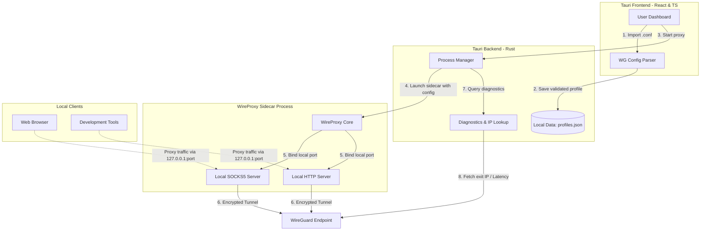

# WirePort

[](LICENSE)
[](CHANGELOG.md)
[](#development-setup)

**WireGuard to SOCKS5/HTTP proxy desktop app for macOS, Windows, and Linux.**

WirePort is a lightweight, high-performance desktop utility that converts any standard WireGuard configuration profile (`.conf`) into a local SOCKS5 proxy or HTTP proxy endpoint. It provides a clean, modern Tauri desktop GUI to import WireGuard profiles, manage custom proxy ports, start/stop tunnels, and monitor real-time connection diagnostics—all without needing terminal commands, root privileges, or manual configuration file edits.

By running the WireGuard tunnel completely in **user-space** via `wireproxy`, WirePort allows you to route individual applications (like web browsers, terminals, development tools, and custom scripts) through a WireGuard tunnel instead of forcing all system-wide traffic through a virtual network adapter.

---

## 🌟 Why WirePort? (Key Advantages)

* **No Administrator / Root Rights Required**: Unlike standard WireGuard clients which require system-level privileges to create virtual network interfaces (`utun` / `tun`), WirePort runs entirely in user-space. This makes it perfect for restricted work environments or corporate laptops.
* **App-Specific Selective Routing (Not a System VPN)**: Keep your main system traffic on your regular ISP connection while routing specific browsers, scraper scripts, development builds, or command-line tools (like `curl`, `git`, or `npm`) through your WireGuard connection.
* **Bypass System VPN Conflicts**: Run your WireGuard tunnel in parallel with system-wide VPNs without causing routing loops, network drops, or gateway conflicts.
* **Developer-Friendly Local Endpoint**: Instantly expose any WireGuard peer as a standardized local SOCKS5 (`127.0.0.1:1080`) or HTTP proxy endpoint.

---

## 🔍 Common Search Terms & Use Cases

People looking for this tool often search for:

* *Convert WireGuard `.conf` configuration to SOCKS5 proxy*
* *Run WireGuard tunnel in user-space without root / admin access*
* *WireGuard to HTTP proxy client wrapper*
* *WireGuard client with selective app routing / bypass system VPN*
* *Wireproxy GUI wrapper desktop app for macOS, Windows, and Linux*
* *Local SOCKS5 proxy server using WireGuard profiles*
* *Route browser traffic through WireGuard profile without full VPN*

---

## 📋 Use Cases

* **Local SOCKS5 Server**: Expose any WireGuard `.conf` file as a local SOCKS5 proxy.
* **Local HTTP Server**: Expose any WireGuard tunnel as a local HTTP proxy.
* **Targeted Proxying**: Configure proxy-aware browsers (using extensions like Proxy SwitchyOmega), scraper bots, or API clients to use the tunnel.
* **Visual Dashboard**: Import, manage, and toggle multiple configuration profiles from a single desktop GUI.
* **Real-time Metrics**: Monitor exit public IP, ISP/country, tunnel latency, active uptime, real-time speed, and aggregated bandwidth consumption.

## 🏷️ Repository Topics (GitHub Tags)

Ensure these topics are configured on the GitHub repository settings for maximum discoverability:

`wireguard`, `wireguard-proxy`, `socks5-proxy`, `http-proxy`, `wireproxy`, `tauri`, `rust`, `react`, `desktop-app`, `vpn-tools`, `proxy-manager`, `macos`, `windows`, `linux`, `userspace-vpn`, `socks5-server`, `http-server`, `vpn-bypass`, `no-root-vpn`, `developer-tools`

---

## How It Works

WirePort acts as a secure GUI wrapper around [wireproxy](https://github.com/octeep/wireproxy). Below is an overview of the data flow and runtime architecture:



---

## Key Features

* **Seamless Import**: Drop in any standard `.conf` profile. WirePort will parse, validate, and store it.
* **Protocol Flexibility**: Easily toggle between SOCKS5 and HTTP protocols.
* **Port Management**: Customize local bind ports (e.g., `1080`) or allocate dynamically.
* **Live Diagnostics**: Real-time monitoring of:
  * Exit Public IP & Country ISP.
  * Connection health, latency, and uptime.
  * Real-time download/upload speed with a **scrolling throughput sparkline**.
  * Cumulative session bandwidth counters.
* **System Tray Support**: Minimize to the system tray for zero-clutter running. Supports quick toggles and system notifications for state changes.
* **Responsive UI**: Adapts from full window down to a compact icon-only sidebar; respects `prefers-reduced-motion`.
* **Offline-First**: Fonts are bundled locally, so the UI renders correctly with no network connection.
* **Advanced Engine Configuration**: Bundle a native `wireproxy` sidecar binary or configure a custom binary path under Application Settings.

---

## Screenshots

> The screenshots below reflect the redesigned interface (tinted-ink theme, signal-green live indicator, monospace telemetry, throughput sparkline).

| Dashboard                                    | Profile Overview                                            |
| -------------------------------------------- | ----------------------------------------------------------- |
|  |   |

| Log Aggregator                     | System Tray Menu                                    |
| ---------------------------------- | --------------------------------------------------- |
|  |  |

---

## Installation

Download the latest macOS release from the [Releases](../../releases) page.

1. Download `WirePort.dmg` (or the package for your OS).
2. Drag **WirePort** to your **Applications** folder.
3. Open **WirePort**.
4. Import your WireGuard configuration file (`.conf`).
5. Choose your proxy port and click **Start**!

---

## Development Setup

To build and run WirePort locally, ensure you have the required toolchains installed.

### Prerequisites

1. **Node.js** (v18+ recommended) and **pnpm** (`npm install -g pnpm`)
2. **Rust & Cargo** toolchain (installed via [rustup.rs](https://rustup.rs))
3. **Tauri dependencies**: Follow the system-specific instructions on the [Tauri v2 Prerequisites Guide](https://v2.tauri.app/start/prerequisites/).

### 1. Clone & Install Dependencies

```bash
git clone https://github.com/rihanoor/WirePort.git
cd WirePort
pnpm install
```

### 2. Sourcing the WireProxy Binary

WirePort uses `wireproxy` as a sidecar process.

1. Download the release binary compatible with your machine from [wireproxy releases](https://github.com/octeep/wireproxy/releases).
2. Create the folder `src-tauri/binaries` and copy the binary inside.
3. Rename the binary according to the expected target triple. For example:
   * macOS (Apple Silicon): `src-tauri/binaries/wireproxy-aarch64-apple-darwin`
   * macOS (Intel): `src-tauri/binaries/wireproxy-x86_64-apple-darwin`
   * Windows: `src-tauri/binaries/wireproxy-x86_64-pc-windows-msvc.exe`
   * Linux: `src-tauri/binaries/wireproxy-x86_64-unknown-linux-gnu`

> [!NOTE]
> In development, you can bypass sidecar compilation by skipping this step and pointing to any custom `wireproxy` binary path directly through the application's **Application Settings** panel.

### 3. Run in Development Mode

Launch the app:

```bash
pnpm tauri dev
```

### 4. Build Production Bundle

To build a standalone installer/binary package for your operating system:

```bash
pnpm tauri build
```

The compiled assets will be available under `src-tauri/target/release/bundle/`.

---

## Project Structure

```text
├── README.md               # Product documentation
├── package.json            # Node/frontend project manifest
├── tsconfig.json           # TypeScript configuration
├── index.html              # HTML entrypoint (no external font links)
├── src/                    # Frontend source code
│   ├── App.tsx             # Main React entrypoint
│   ├── App.css             # Single design-system stylesheet (tokens + surfaces)
│   ├── main.tsx            # DOM initialization
│   ├── assets/
│   │   └── fonts/          # Bundled IBM Plex Mono woff2 (offline-safe)
│   ├── components/         # Dashboard, sidebar, profile details, sparkline, toggle
│   └── types/              # Shared TS Interfaces
└── src-tauri/              # Rust desktop backend
    ├── Cargo.toml          # Rust package config
    ├── build.rs            # Tauri build-time scripts
    ├── tauri.conf.json     # Tauri app configuration, permissions, and CSP
    └── src/
        ├── main.rs         # Execution entrypoint
        └── lib.rs          # Process management, log aggregation, proxy logic, tray
```

---

## Community Guidelines

* **Contributing**: Check out [CONTRIBUTING.md](CONTRIBUTING.md) to understand code guidelines, style preferences, and how to submit pull requests.
* **Code of Conduct**: This project follows the Contributor Covenant. See [CODE_OF_CONDUCT.md](CODE_OF_CONDUCT.md) for details.
* **Security Policies**: Found a security issue? Please refer to [SECURITY.md](SECURITY.md) to report it privately.

---

## Disclaimer

WirePort is a local WireGuard proxy management tool. Users are responsible for complying with the terms and policies of their VPN provider and local regulations.

---

## License

This project is licensed under the MIT License. See [LICENSE](LICENSE) for details.
